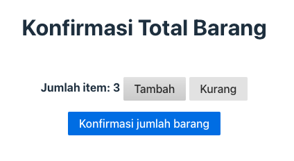

# Suarise A11Y Bootcamp Code Companion

Code template buat kelas Best Practice A11Y Development

## Tech Stack

- [Node.js](https://nodejs.org)
- Template aplikasi ini di-generate dengan menggunakan [Vite](https://vitejs.dev/) ⚡️

## Instruksi

1. Pastikan telah meng-install [Node.js](https://nodejs.org/en/download/) versi LTS (node-v20 atau node-v18).
1. Pastikan Node.js bisa diakses dari Command Line dengan `node --version`
1. Pindah ke direktori project: `cd suarise-a11y-bootcamp`
1. Install dependensi: `npm install`
1. Jalankan aplikasi: `npm run dev`

Kalau instalasi tepat, command line akan menampilkan:

```
VITE v5.1.0  ready in 5124 ms

  ➜  Local:   http://localhost:5173/
  ➜  Network: use --host to expose
  ➜  press h + enter to show help
```

Page dari aplikasi ini dapat di akses dari browser dengan alamat http://localhost:5173/ dan akan muncul *placeholder page*:


Example 01 dapat diakses dengan http://localhost:5173/01-simple-counter/index.html
Untuk memastikan aplikasi berjalan dengan baik, klik tombol tambah atau kurang untuk mengubah angka jumlah. Note: tombol konfirmasi memang sengaja tidak berfungsi.


